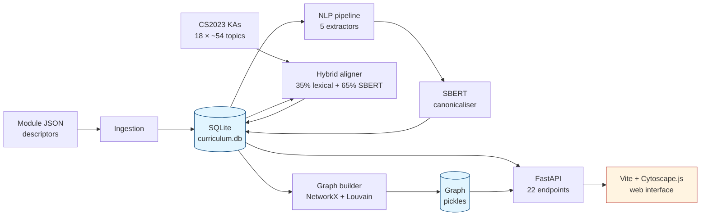

# AI Curriculum Mapper

[](https://github.com/alanj5/ai-curriculum-mapper/actions/workflows/test.yml)
[](https://www.python.org/downloads/)
[](LICENSE)
[](#test-coverage-summary-v100)

Automated extraction, alignment, and visualisation of Computing curriculum content against ACM/IEEE CS2023 Knowledge Areas.

**Author:** Alan Jiang — Imperial College London BEng Computing Final Year Project
**Version:** 1.0.0

---

## Overview

The system ingests 21 Imperial College Computing module descriptors, extracts key concepts using five NLP methods (TF-IDF, RAKE, TextRank, KeyBERT, BERTopic), applies a concept-specificity filter and SBERT canonicalisation to yield 658 unique concepts, aligns each concept to the 18 ACM/IEEE CS2023 Knowledge Areas using a hybrid lexical+semantic aligner, constructs a module-module similarity graph, and exposes all results through an interactive web interface.

### Architecture



**Numbers (from a complete pipeline run on the 21-module corpus):** 21 modules → 658 canonical concepts (after the specificity filter and SBERT canonicalisation) → 1,030 alignment records (152 ambiguous concepts, 23.1%) → 146 module-module edges across 4 Louvain communities (modularity Q = 0.46).

---

## Screenshots

> Screenshots of the interactive web interface can be regenerated locally by
> starting the dev server (`make serve` + `cd frontend && npm run dev`) and
> taking captures of the three tabs.
>
> - **Graph tab** — force-directed module-module graph (Cytoscape.js fcose), with
>   nodes coloured by Louvain community and sized by degree centrality.
> - **Alignments tab** — sortable concept × KA table with inline
>   accept / reject / reassign controls and ambiguity highlights.
> - **Gap Report tab** — horizontal bar chart of CS2023 KA coverage percentages
>   plus summary cards for modules / concepts / alignments / ambiguous count.

## Requirements

- Python 3.11+
- Node.js 18+ and npm
- ~2 GB free disk (SBERT model + embeddings cache)

---

## Setup

```bash
# 1. Clone / navigate to project
cd ai-curriculum-mapper

# 2. Create virtual environment
python3 -m venv .venv
source .venv/bin/activate          # Windows: .venv\Scripts\activate

# 3. Install Python dependencies
pip install -r requirements.txt
pip install -r requirements-dev.txt

# 4. Download NLP models
python -m spacy download en_core_web_sm
python -c "import nltk; nltk.download(['stopwords', 'wordnet', 'punkt', 'averaged_perceptron_tagger'])"

# 5. Install frontend dependencies
cd frontend && npm install && cd ..
```

---

## Running the Pipeline

These steps populate the SQLite database (`data/curriculum.db`) from scratch.  
**Run in order** — each step depends on the previous.

```bash
source .venv/bin/activate

# Step 1: Ingest module descriptors → populates modules, ilos, prerequisites tables
python scripts/ingest_modules.py

# Step 2: Run NLP extraction → populates concepts table (658 concepts, ~3–5 min)
python scripts/run_nlp_pipeline.py --week2

# Step 3: Align concepts to CS2023 KAs → populates alignments table (~1–2 min)
python scripts/run_alignment.py

# Step 4: Build graphs → writes .pkl files to data/cache/graphs/ (~30 s)
python scripts/build_graph.py

# Step 5 (optional): Run evaluation against gold annotations
python scripts/run_evaluation.py
```

All steps are **idempotent** — safe to re-run. The DB uses `INSERT OR REPLACE`.

---

## Starting the Web Application

### Option A — Development (hot-reload)

```bash
# Terminal 1: Backend API
source .venv/bin/activate
uvicorn curriculum_mapper.api.main:app --reload --host 127.0.0.1 --port 8000

# Terminal 2: Frontend dev server
cd frontend
npm run dev           # http://localhost:5173
```

Open **http://localhost:5173** in a browser.

### Option B — Production build

```bash
cd frontend
npm run build         # outputs to frontend/dist/

source ../.venv/bin/activate
uvicorn curriculum_mapper.api.main:app --host 127.0.0.1 --port 8000
```

Open **http://127.0.0.1:8000** — FastAPI serves `frontend/dist/` at `/`.

---

## API Reference

Interactive docs (Swagger UI): **http://127.0.0.1:8000/docs**

| Endpoint | Method | Description |
|---|---|---|
| `/health` | GET | System health + DB counts |
| `/api/v1/modules/` | GET | List modules (`?level=2&search=algorithm`) |
| `/api/v1/modules/{code}` | GET | Full module detail with ILOs |
| `/api/v1/modules/{code}/concepts` | GET | Extracted concepts for a module |
| `/api/v1/modules/{code}/alignments` | GET | KA alignments for a module |
| `/api/v1/modules/{code}/neighbors` | GET | Similar modules (by Jaccard) |
| `/api/v1/concepts/` | GET | List all concepts (`?ka=AL&search=sort`) |
| `/api/v1/alignments/` | GET | All alignments with filters |
| `/api/v1/alignments/stats` | GET | Counts by KA, method, validation status |
| `/api/v1/alignments/{id}/validate` | PATCH | Accept / reject / reassign an alignment |
| `/api/v1/graph/module-module` | GET | Cytoscape.js graph JSON (nodes + edges) |
| `/api/v1/graph/module-concept` | GET | Bipartite graph for one module |
| `/api/v1/graph/communities` | GET | Louvain community assignments |
| `/api/v1/graph/centrality` | GET | Degree, betweenness, eigenvector centrality |
| `/api/v1/reports/coverage` | GET | Per-KA coverage fractions |
| `/api/v1/reports/gaps` | GET | KAs below coverage threshold |
| `/api/v1/reports/redundancies` | GET | Concepts appearing in too many modules |
| `/api/v1/reports/summary` | GET | Full curriculum health summary |
| `/api/v1/reports/export` | GET | Complete JSON curriculum snapshot |

### Example requests

```bash
# 1. Check the system is up
curl http://127.0.0.1:8000/health
# → {"status":"ok","modules":21,"concepts":658,"alignments":1030}

# 2. List all Year 2 modules
curl 'http://127.0.0.1:8000/api/v1/modules/?level=2'

# 3. Fetch alignments for IC50001, filtered by KA = Algorithms and only ambiguous
curl 'http://127.0.0.1:8000/api/v1/modules/IC50001/alignments?ka=AL&ambiguous_only=true'

# 4. Get the Cytoscape-formatted module-module graph
curl http://127.0.0.1:8000/api/v1/graph/module-module | jq '.nodes | length'
# → 21

# 5. Validate an alignment (accept) — writes to user_feedback audit table
curl -X PATCH 'http://127.0.0.1:8000/api/v1/alignments/42/validate' \
     -H 'Content-Type: application/json' \
     -d '{"action":"accept","comment":"verified by reviewer"}'

# 6. KA coverage report
curl http://127.0.0.1:8000/api/v1/reports/coverage | jq '.coverage'
```

---

## Deployment

### Docker (recommended for a single-command setup)

```bash
# Build the image and start the API + frontend on http://localhost:8000
docker compose up --build

# First boot runs the full pipeline inside the container; subsequent boots reuse the
# SQLite database via the ./data volume mount.
```

Override configuration at runtime via environment variables (see `.env.example` for the
full list — `API_HOST`, `API_PORT`, `CORS_ORIGINS`, `CURRICULUM_DB_PATH`).

### Manual (without Docker)

Follow the **Setup** and **Running the Pipeline** sections above, then run the production
build path described in **Starting the Web Application → Option B**.

---

## Running Tests

### Full test suite

```bash
source .venv/bin/activate
python -m pytest tests/ -q
# Expected: 385 passed in ~14 s
```

### With coverage report

```bash
python -m pytest --cov=curriculum_mapper --cov-report=html -q
# Opens htmlcov/index.html for line-level coverage details
# Current coverage: 83% (full suite)
```

### Unit tests only (fast, no DB required for most)

```bash
python -m pytest tests/unit/ -q
# ~318 tests, ~12 s
```

### Integration tests only (requires populated DB)

```bash
python -m pytest tests/integration/ -v
# 66 tests against real SQLite DB via ASGI transport
```

### By test module

```bash
python -m pytest tests/unit/test_aligners.py -v        # Alignment logic
python -m pytest tests/unit/test_metrics.py -v         # Evaluation metrics
python -m pytest tests/unit/test_graph.py -v           # Graph construction
python -m pytest tests/unit/test_benchmarks.py -v      # Benchmark runner
python -m pytest tests/unit/test_reports.py -v         # Report generation
python -m pytest tests/unit/test_canonicalizer.py -v   # Concept deduplication
python -m pytest tests/unit/test_keybert_extractor.py -v  # KeyBERT
```

### Code quality

```bash
python -m ruff check curriculum_mapper/ tests/     # Linting (all checks pass)
python -m black --check curriculum_mapper/ tests/  # Formatting check
```

---

## Test Coverage Summary (v1.0.0)

| Module | Coverage |
|---|---|
| `evaluation/metrics.py` | 100% |
| `evaluation/reports.py` | 98% |
| `evaluation/benchmarks.py` | 69%\* |
| `alignment/ambiguity.py` | 100% |
| `alignment/hybrid.py` | 100% |
| `alignment/aligner.py` | 100% |
| `nlp/canonicalizer.py` | 92% |
| `nlp/extractors/keybert_extractor.py` | 100% |
| `nlp/extractors/tfidf_extractor.py` | 100% |
| `ingestion/storage.py` | 97% |
| `api/schemas.py` | 100% |
| **TOTAL** | **83%** |

\*`benchmarks.py` includes CLI-only extended ablations (aligner weight sweep, per-extractor comparison) that are exercised end-to-end by `scripts/run_evaluation.py` rather than in unit tests.

---

## Project Structure

```
ai-curriculum-mapper/
├── curriculum_mapper/          # Main Python package
│   ├── config.py               # All thresholds and constants
│   ├── ingestion/              # Module loading, normalisation, SQLite storage
│   ├── nlp/                    # 5 extractors, embeddings, canonicalizer, pipeline
│   ├── alignment/              # Lexical, semantic, hybrid aligners + ambiguity detection
│   ├── graph/                  # NetworkX graph builder, analytics, gap detector
│   ├── evaluation/             # Metrics, benchmark runner, report generation
│   └── api/                    # FastAPI app, routers, schemas
├── frontend/                   # Vite + vanilla JS
│   ├── index.html
│   └── src/
│       ├── main.js
│       ├── api.js
│       ├── components/         # GraphView, ModulePanel, AlignmentTable, GapReport, ValidationWidget
│       └── styles/main.css
├── scripts/                    # Pipeline entry points
│   ├── ingest_modules.py
│   ├── run_nlp_pipeline.py
│   ├── run_alignment.py
│   ├── build_graph.py
│   └── run_evaluation.py
├── tests/
│   ├── unit/                   # 278 unit tests (fast, mock-based)
│   └── integration/            # 66 integration tests (real DB, ASGI transport)
├── data/
│   ├── raw/modules/            # Imperial College JSON module descriptors
│   ├── raw/standards/          # cs2023_ka.json (18 KAs, 974 topic strings)
│   ├── annotations/            # Gold-annotated concepts (5 modules, 77 concepts)
│   ├── cache/                  # Embedding cache (.npy) + graph pickles (.pkl)
│   └── processed/              # Evaluation outputs + figures
└── requirements.txt
```

---

## Key Configuration (`curriculum_mapper/config.py`)

| Parameter | Value | Effect |
|---|---|---|
| `SBERT_MODEL` | `all-MiniLM-L6-v2` | 384-dim, 80 MB, 6× faster than mpnet |
| `SIMILARITY_THRESHOLD` | 0.35 | Minimum hybrid score to store an alignment |
| `SBERT_MATCH_THRESHOLD` | 0.75 | Partial credit threshold for evaluation |
| `LEXICAL_WEIGHT` | 0.35 | Weight of lexical score in hybrid aligner |
| `SEMANTIC_WEIGHT` | 0.65 | Weight of SBERT score in hybrid aligner |
| `SHARED_CONCEPT_EDGE_MIN` | 2 | Minimum shared concepts for a graph edge |
| `AMBIGUITY_MARGIN` | 0.08 | Score gap below which top-2 alignments are ambiguous |
| `GAP_COVERAGE_THRESHOLD` | 0.10 | KAs below 10% module coverage are flagged |
| `REDUNDANCY_THRESHOLD` | 5 | Concepts in >5 modules flagged as redundant |

---

## Reproducibility

All random seeds are fixed:
- BERTopic UMAP: `random_state=42`
- Louvain community detection: `random_state=42`
- HDBSCAN: deterministic with fixed UMAP seed

The embedding cache (`data/cache/embeddings/`) uses SHA-256 content keys, so repeated runs with the same text produce identical results without re-encoding.

The full pipeline is reproducible from a clean clone:
```bash
make setup && make pipeline && make evaluate && make test
```

---

## Citing this work

If you use this software in research or teaching, please cite it via the
[`CITATION.cff`](CITATION.cff) file in this repository (GitHub renders a one-click
"Cite this repository" widget on the repo home page), or use the BibTeX entry below:

```bibtex
@thesis{jiang2026curriculum,
  title  = {AI-Driven Curriculum Mapping for Computing Education},
  author = {Jiang, Alan},
  school = {Imperial College London, Department of Computing},
  year   = {2026},
  month  = {5},
  type   = {BEng dissertation},
  url    = {https://github.com/alanj5/ai-curriculum-mapper}
}
```

---

## License

Released under the [MIT License](LICENSE). See `LICENSE` for the full text.
